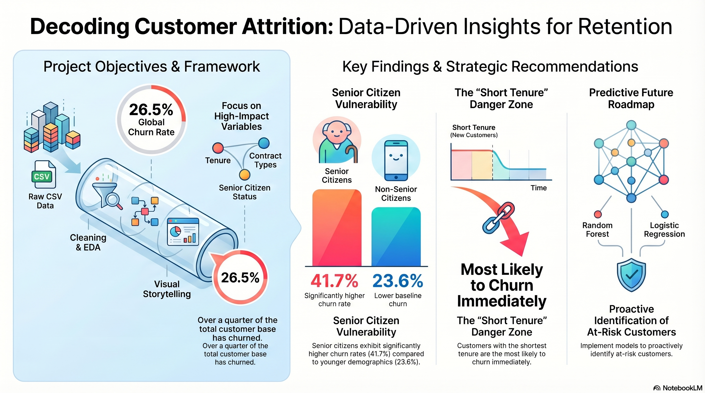

 


# 📘 Customer Churn Analysis – End-to-End Python Project

## 📌 Project Overview

This project is an **end-to-end data analysis pipeline built in Python** to explore customer behavior and identify the key factors driving **customer churn**.

It focuses on:

* Data cleaning and preprocessing
* Exploratory Data Analysis (EDA)
* Visual storytelling to extract business insights

The analysis walks through the complete lifecycle — from a raw CSV dataset to **actionable insights**, making it a strong demonstration of practical data analysis skills using Python.

---

## 🎯 Objectives

The primary objectives of this project are to: 

* Clean and preprocess real-world structured data
* Perform exploratory data analysis (EDA) to uncover churn patterns
* Identify relationships between churn and key customer attributes, including:

  * Gender
  * Senior citizen status
  * Contract type
  * Tenure
  * Internet services
  * Payment methods
* Communicate insights clearly using charts and summary statistics

---

## 🛠️ Tech Stack

* **Python 3**
* **Pandas** – data manipulation and cleaning
* **NumPy** – numerical computations
* **Matplotlib** – data visualization
* **Seaborn** – statistical and comparative plots
* **Jupyter Notebook / Google Colab** – interactive analysis environment

---

## 📂 Project Structure

```
journal-analysis-project/
│
├── End-to-End Project.ipynb   # Main analysis notebook
├── Churn_table.csv            # Input dataset
├── README.md                  # Project documentation
```

---

## ⚙️ Setup Instructions

### 1️⃣ Clone the Repository

```bash
git clone https://github.com/your-username/journal-analysis-project.git
cd journal-analysis-project
```

### 2️⃣ Install Dependencies

```bash
pip install pandas numpy matplotlib seaborn
```

### 3️⃣ Run the Notebook

```bash
jupyter notebook
```

Open `End-to-End Project.ipynb` and run the cells sequentially.

> 💡 Tip: You can also upload the notebook directly to **Google Colab** and run it without local setup.

---

## 🚀 Key Features

* ✔️ Data cleaning (handling missing values and type conversions)
* ✔️ Exploratory Data Analysis (EDA)
* ✔️ Feature-wise churn comparison
* ✔️ Business-focused interpretation of results

---

## 📷 Visual Highlights

### 🔹 Churn Distribution by Gender (Count Plot)


---

### 🔹 Overall Churn Percentage (Pie Chart)


---

### 🔹 Tenure vs Churn (Histogram)


---

### 🔹 Churn by Senior Citizen Status (Stacked Bar Chart)


---

### 🔹 Multi-Feature Comparison (Subplots)


---

## 📊 Sample Insights Generated

* A significant portion of customers have churned, indicating retention challenges
* **Month-to-month contracts** show the highest churn rates
* Customers with **shorter tenure** are more likely to churn
* **Payment method choice** has a noticeable impact on churn behavior
* **Senior citizens** exhibit different churn patterns compared to non-senior customers

These findings highlight how data analysis can directly support **business and retention strategy decisions**.

---

## 📈 Future Improvements

* Add predictive models (Logistic Regression, Random Forest)
* Perform feature engineering and correlation analysis
* Convert the notebook into reusable Python modules
* Build interactive dashboards using Plotly or Streamlit

---

## 🤝 Contributing

Contributions are welcome!
If you’d like to improve the analysis, enhance visualizations, or add machine learning models, feel free to fork the repository and submit a pull request.

---

## 📬 Contact

If you have questions or suggestions, feel free to:

* Connect with me on **LinkedIn**
* Open an issue in this repository


